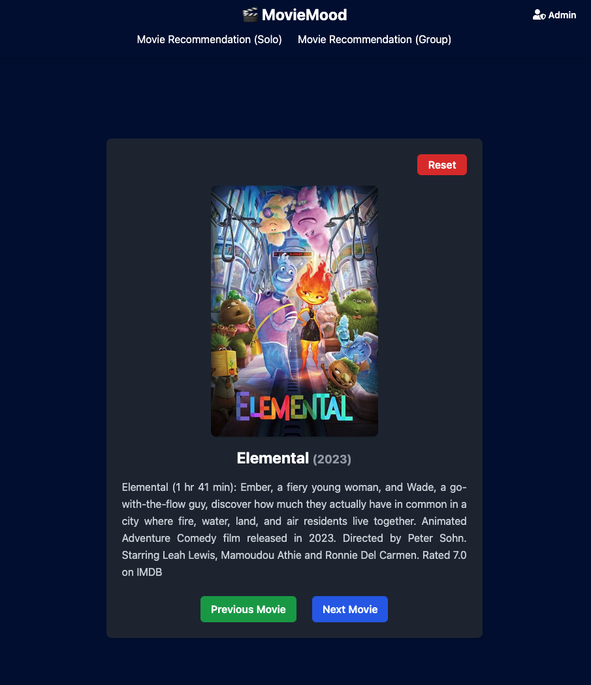

<h1>AI Projects 🤖</h1>

This folder contains AI-powered projects leveraging modern technologies such as OpenAI, embeddings, and advanced APIs to build intelligent applications.
 

|      Project        | Description |
| ------------------- | --------------- |
| **Movie Mood AI App 🎬** | Smart movie recommendation based on your mood and group preferences powered by AI and embeddings. |

## Movie Mood AI App
Smart movie recommendation tool that helps you find the perfect movie based on your mood and preferences. Whether watching alone or with friends, the app delivers curated suggestions powered by AI or embeddings.

### What It Does
  - Fill out a short form about your mood and viewing context.
  - Get personalized movie recommendations.
  - Choose between two recommendation engines:
    - ChatGPT Mode: Uses ChatGPT to generate custom movie suggestions.
    - Embeddings Mode: Finds closest matches in a Supabase movie database using vector embeddings.

### Modes
  - Solo Mode: Individual personalized recommendations.
  - Group Mode: Up to 20 people enter preferences; app suggests a movie fitting the group mood.

### Technologies:
  - React / Vite / TypeScript (Frontend)
  - Supabase (Embeddings & movie DB)
  - OpenAI API (ChatGPT + Embeddings)
  - TMDB API (Movie posters and metadata)
  - Tailwind CSS (UI Styling)
  - Express (Backend)
  - Playwright (End-to-end testing)

  

